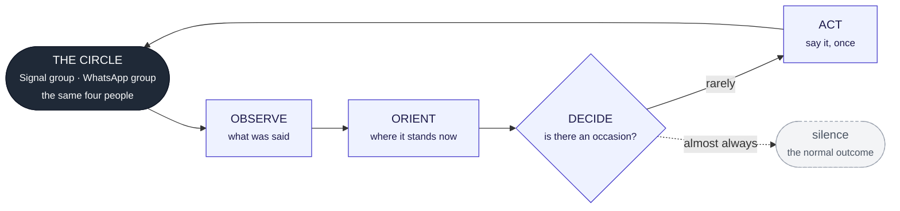
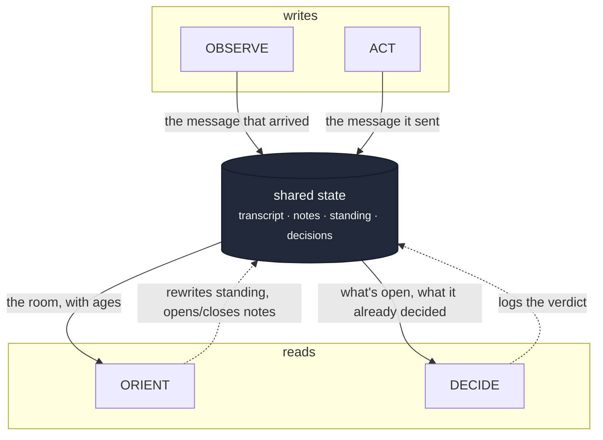
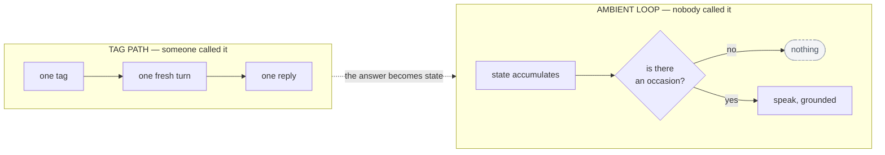

# The diagram

One diagram has to land in about five seconds, from the back of a room, on
a slide nobody will pause. That is diagram 1. Everything else on this page
is for the person who leans in afterwards and asks a second question.

---

## 1. The five-second diagram

The only thing it has to say: **this is a circle, it starts and ends with
people, and most of the time the answer is silence.**



If the slide only gets one caption, it is this:

> **Nobody is at the start of that arrow.**

ASCII fallback, for a terminal or a README:

```
   THE CIRCLE ──▶ OBSERVE ──▶ ORIENT ──▶ DECIDE ──┬──▶ ACT ──┐
        ▲                                          │          │
        │                                          └┈┈▶ silence│
        └──────────────────────────────────────────────────────┘
```

---

## 2. Memory is the medium

Show this one only if someone asks how the loop survives between model
calls — which, when the demo has worked, they will.

The point of the picture is the direction of the arrows: **memory is
written at the edges and read in the middle.** There is no arrow from one
stage directly into another.



The claim this diagram is making:

> **The model is disposable; the cognition is not.**

Every reasoning turn is fresh. Nothing is carried in a long-lived LLM
session, because there isn't one. Kill the process, swap the model — the
group's context is untouched, because it was never in the model.

---

## 3. The two backbones

Only for the deep-dive question "so how is the tag different from the
ambient path?"



| | tag path | ambient loop |
|---|---|---|
| trigger | a person | a state |
| scope | one room, one exchange | the whole circle, across time |
| question | "what's the answer?" | "is there an occasion?" |
| usual outcome | a reply | nothing |

The tag path feeds the ambient loop: once it has answered, it folds the
exchange back into the room's standing position and into what's still
open. An answer is not the end of a conversation; it is a change in state.

---

## 4. Proactivity, if the "isn't this a heartbeat?" question comes

Do not draw this unless asked. If asked, draw it small, by hand, in two
lines:

```
heartbeat :   schedule ──▶ cognition
Ora       :   cognition ──▶ intention ──▶ schedule ──▶ cognition
                                                          │
                                            re-reads the room, may decline
```

---

## Producing the PNGs

Two images are needed before the 14:15 record block:

1. **Title card** — "Ora — one circle, one loop", tagline underneath.
2. **Diagram 1**, rendered clean, for the closing frame of the video and
   the closing slide.

Render diagram 1 from this file (any Mermaid renderer, or paste into
mermaid.live), export at **1920 × 1080** on a white or very dark
background — it will be seen over a screen recording, so contrast matters
more than prettiness. Check it at 25% zoom: if the five words
OBSERVE / ORIENT / DECIDE / ACT / silence are not readable, the type is
too small.

**Owner: teammate B. Due 13:00**, before rehearsal #2, so both PNGs exist
before recording rather than during it.
